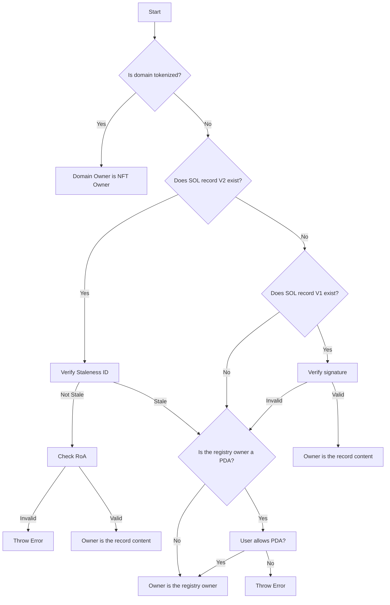

# SNS IP 5

### SNS-IP Number: 5

### Title: Domain name resolution

### Author(s): Bonfida

### Status: Draft

### Created: May 2024

### Updated: N/A

## Abstract

This proposal aims to standardize the process for resolving .sol domain names on Solana.

## Motivation

Domain resolution differs from domain ownership, providing more flexibility in routing funds. For instance, it enables a domain owned by a multisig or cold wallet to direct funds to a hot wallet. This flexibility is essential for specific configurations. Our design goals for a good resolution system include:

- **Consistency:** Ensuring the resolution process yields reliable and expected results regardless of the domain's state or ownership changes.
- **Predictability:** The system's behavior should be understandable and predictable to users, minimizing unexpected outcomes.
- **Security:** The resolution process must safeguard against errors, prevent loss of funds of misdirection of funds.

We also aim to encourage high-security setups by allowing domains to be owned by DAO multisigs or other secure storage solutions while routing funds to more frequently used addresses. This decoupling of secure storage from day-to-day use addresses improves security and flexibility.

## Specification

1. If the domain is tokenized:
   1. The domain owner is the NFT owner.
   2. A tokenized domain is a domain that is held in a name-tokenizer escrow. You can verify this by checking if the domain owner is a Program Derived Account (PDA) owned by the name-tokenizer program, or by confirming that the name tokenizer NFT record for the given domain is active.
2. If the SOL record v2 exists:
   - (a) Verify the staleness ID. If it's stale, the owner is the registry owner. If not, proceed to 2.b.
   - (b) Check the RoA. If it's invalid, throw an error. If not, the owner is the record content.
   - Refer to the SNS-IP 3 for more information about records V2
3. If the SOL record V1 exists and the SOL record V2 does not:
   1. If the signature is valid, the owner is the record content. If not, proceed to step 4.
4. The owner is the registry owner.
   1. The owner of the registry is defined as the `owner` field within the `NameRegistry` struct, which is stored in the domain account.
   2. If the registry `owner` is a PDA:
      1. If the user has not explicitly allowed the result to be a PDA, this must result in an error.
      2. The application performing the resolution must ask for the program IDs that the PDA can belong to in the case where the user allows PDA.
      3. Allowing any program ID for PDAs is not recommended due to security concerns.

## Rationale

The resolution process prioritizes backward compatibility and security. For tokenized domains, ownership records are not checked as the domain is held in escrow, making the NFT owner the priority. If SOL record V2 exists, an invalid RoA results in an error, while a stale record defaults to the registry owner. SOL record V1 is checked only if V2 does not exist, ensuring backward compatibility.

## Backwards Compatibility

This SNS IP maintains backward compatibility. If a new NFT standard is adopted, the name-tokenizer escrow will still ensure backward compatibility as proposed in this SNS-IP, since only one token can exist at a time.

It also maintains compatibility with record V1 users, as it continues to use it when the record V2 does not exist.

## Security Considerations

- The registry owner is deemed safe. This is because it is the default resolution result in the simplest case (i.e., non-tokenized and no SOL record), and it's the address that needs to sign in order to set a different address for resolution, such as tokenizing the domain or setting an SOL record. Since the owner's consent is necessary to change the resolution address for their public key, it's considered safe to use it as a fallback. However, if the registry owner is a PDA, the fallback must only be made if explicitly allowed by the user performing the resolution.
- Loss of funds can occur if domains are sent to incorrect addresses due to staleness/ROA check errors.
- Proper signature verification is critical in record V1 situations

## Test Cases

| Domain             | Is Domain Tokenized? | SOL Record V2 Exists? | Staleness ID | RoA Valid? | SOL Record V1 Exists? | Signature Valid? | Registry Owner PDA? | User Allows PDA? | Owner          |                  Public key                  |
| ------------------ | -------------------- | --------------------- | ------------ | ---------- | --------------------- | ---------------- | ------------------- | ---------------- | -------------- | :------------------------------------------: |
| sns-ip-5-wallet-1  | Yes                  | -                     | -            | -          | -                     | -                | -                   | -                | NFT Owner      | ALd1XSrQMCPSRayYUoUZnp6KcP6gERfJhWzkP49CkXKs |
| sns-ip-5-wallet-2  | No                   | Yes                   | Not Stale    | Valid      | -                     | -                | -                   | -                | Record Content | AxwzQXhZNJb9zLyiHUQA12L2GL7CxvUNrp6neee6r3cA |
| sns-ip-5-wallet-3  | No                   | Yes                   | Not Stale    | Invalid    | -                     | -                | -                   | -                | Throw Error    |                      -                       |
| sns-ip-5-wallet-4  | No                   | Yes                   | Stale        | -          | -                     | -                | No                  | -                | Registry Owner | 7PLHHJawDoa4PGJUK3mUnusV7SEVwZwEyV5csVzm86J4 |
| sns-ip-5-wallet-5  | No                   | Yes                   | Stale        | -          | -                     | -                | Yes                 | Yes              | Registry Owner | 96GKJgm2W3P8Bae78brPrJf4Yi9AN1wtPJwg2XVQ2rMr |
| sns-ip-5-wallet-6  | No                   | Yes                   | Stale        | -          | -                     | -                | Yes                 | No               | Throw Error    |                      -                       |
| sns-ip-5-wallet-7  | No                   | No                    | -            | -          | Yes                   | Valid            | -                   | -                | Record Content | 53Ujp7go6CETvC7LTyxBuyopp5ivjKt6VSfixLm1pQrH |
| sns-ip-5-wallet-8  | No                   | No                    | -            | -          | Yes                   | Invalid          | -                   | -                | Registry Owner | ALd1XSrQMCPSRayYUoUZnp6KcP6gERfJhWzkP49CkXKs |
| sns-ip-5-wallet-9  | No                   | No                    | -            | -          | No                    | -                | No                  | -                | Registry Owner | ALd1XSrQMCPSRayYUoUZnp6KcP6gERfJhWzkP49CkXKs |
| sns-ip-5-wallet-10 | No                   | No                    | -            | -          | No                    | -                | Yes                 | Yes              | Registry Owner | 96GKJgm2W3P8Bae78brPrJf4Yi9AN1wtPJwg2XVQ2rMr |
| sns-ip-5-wallet-11 | No                   | No                    | -            | -          | No                    | -                | Yes                 | No               | Throw Error    |                      -                       |
| sns-ip-5-wallet-12 | No                   | Yes                   | Not Stale    | Invalid    | Yes                   | -                | -                   | -                | Throw Error    |                      -                       |

## Implementation

TODO

## References

- SNS IP 3
